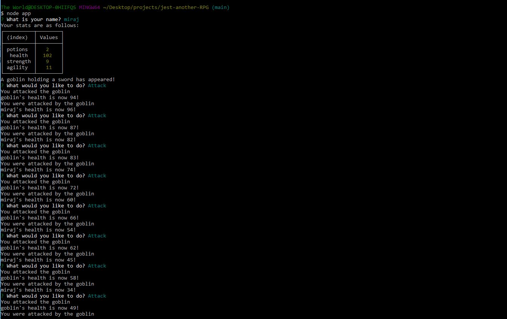
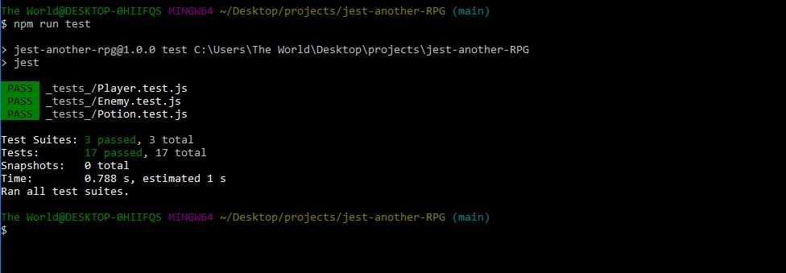

# jest-another-RPG

Client requested to create a command-line role-playing game. In this game player battles against a series of enemies whose health and stat is sustained by a potion.

* Minimum requirements from the clients are as follow  : 

1. Create an RPG and organize the code by player objects, enemy objects, and potion objects.

1. The three main objects should have tests written for them.

1. A fourth Game object encompasses all of the game logic.

1. The game can be played in the command line based on user input.
 

## Usage 
1. Clone the repo first in your local computer. 
1. Then in command prompt under the root directory, You can test by typing " npm run test ".
1. To run the game, type " node app ". This will ask for player name and then series of questions. 

## Below is the screenshot and Deployed application of the Project as per client request ## 

[Please click here to deploy application](https://github.com/miraj00/jest-another-RPG)
